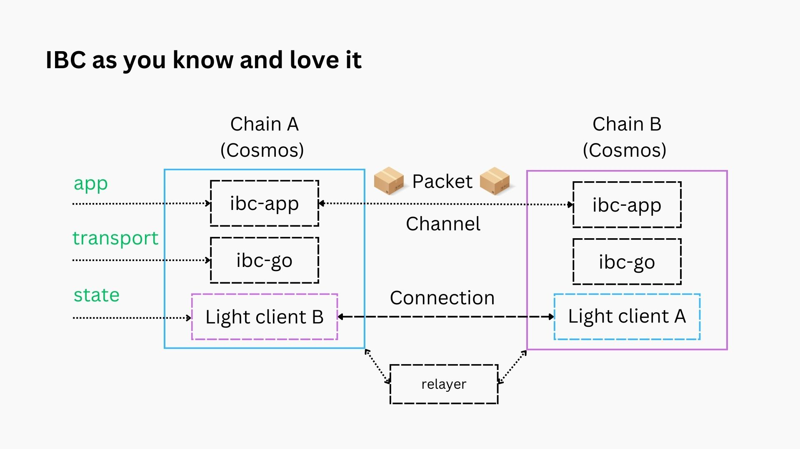
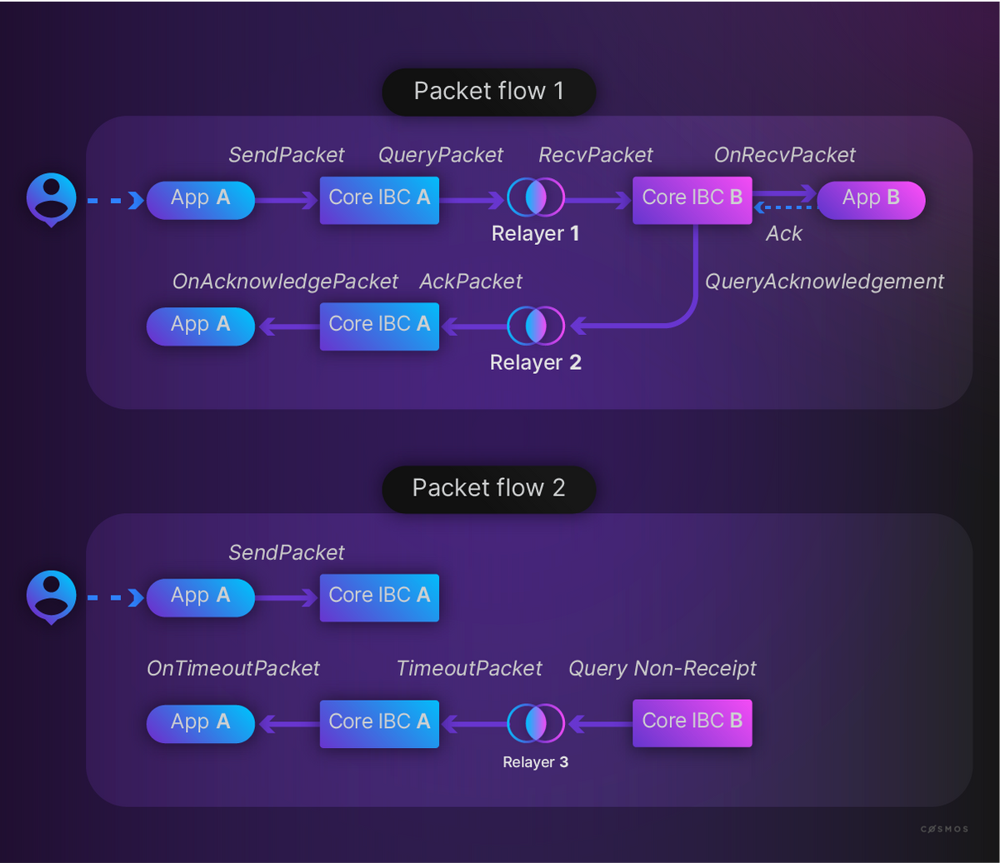

# IBC

In February 2021, the Cosmos Stargate release brought the Inter-Blockchain Communication (IBC) protocol into the world. Stargate was a set of upgrades that implemented the original vision laid out in the Cosmos whitepaper — to build a network of sovereign, interoperable blockchains.

IBC is a **general-purpose, message-passing solution that allows blockchains to communicate in a trust-minimized, and permissionless way**. The IBC community, Polymer included, envisions a world where IBC acts as the connective tissue for the _Internet of blockchains_.

The aim here is not to give an in-depth dissertation on IBC. There are already a number of resources starting that work. Be sure to check out these resources if you haven't already:

- The [IBC specification](https://github.com/cosmos/ibc/)
- The [ibc-go documentation](https://ibc.cosmos.network/): ibc-go is the IBC implementation of the core IBC protocol for Cosmos SDK chains and is currently the most advanced IBC implementation. It is also the IBC implementation run on Polymer.
- The [IBC section of the Comsos Developer Portal](https://tutorials.cosmos.network/academy/3-ibc/): a more beginner friendly documentation of IBC (mainly ibc-go) targeted at developers
- The [Interchain Foundation Medium](https://medium.com/the-interchain-foundation/tagged/ibc): blog posts about IBC aimed at wider audiences, including product
- And of course, our very own Polymer docs

<!-- This section can be altered or removed if we repurpose the docs somewhere else -->

The section here will give a quick high-level overview that will discuss the most important abstractions from the IBC protocol, especially those concerning application developers (e.g. those writing IBC enabled smart contracts) that want to use the IBC SDK tooling.

## IBC as you know it already

IBC is the major selling point for Cosmos chains. 50+ Cosmos chains are already connected with one another through IBC. So the setup depicted below should be familiar to anyone with knowledge of IBC within Cosmos.

We identify the following components:

- both chains run **on-chain light clients** that track the counterparty's consensus state that perform state verification, i.e. the state layer
- both chains include the [ibc-go module](https://github.com/cosmos/ibc-go) that implements transport, authentication and ordering logic, i.e. the transport layer
- both chains have **IBC application modules**, they can trigger packets being sent and provide encoding/decoding of the packet data as well as the business logic related to the packet lifecycle, i.e. the application layer
- a connection built on top of the light clients
- a channel built on top of the connection, to facilitate the packet flow
- at least one **relayer (an off-chain process)** is live to listen for IBC events and relay the required messages and proofs for the IBC protocol to function



## IBC clients

IBC light clients are the bottom layer of the IBC abstractions. They concern the state layer of the IBC protocol. As for the purposes of application developers, the clients are not central to their daily development life (that is, provided they are available and a connection and channel have been built on top for them to interact with).

Hence we encourage the reader to investigate for themselves how clients work in the [02-client specification](https://github.com/cosmos/ibc/blob/main/spec/core/ics-002-client-semantics/README.md) or [the developer summary](https://tutorials.cosmos.network/academy/3-ibc/4-clients.html) and [the light client development guide](https://tutorials.cosmos.network/academy/3-ibc/5-light-client-dev.html).

A short and succinct summary of a light client's functionality is the following: a **light client stores a trusted consensus state, and provides functionality to verify updates to the consensus state or verify packet commitments against the trusted root by using Merkle proofs.**

## Connections

Once we have clients on either chain wishing to connect to one another, the next step is to build a connection on top.

If you want to connect two blockchains with IBC, you will need to establish an IBC **connection**. Connections, established by a four-way handshake, are responsible for:

1. Establishing the identity of the counterparty chain.
2. Preventing a malicious entity from forging incorrect information by pretending to be the counterparty chain. IBC connections are established by on-chain ledger code and therefore do not require interaction with off-chain (trusted) third-party processes.

The four handshake steps are (triggered by chain A, to connect to chain B):

1. `ConnOpenInit` Hello chain B, here is information that you can use to
   verify I am chain A. Do you have information I can use?
2. `ConnOpenTry` Hello chain A, I have verified that you are who you say
   you are. Here is my verification information.
3. `ConnOpenAck` Hello chain B. Thank you for that information I have
   verified you are who you say you are. I am now ready to talk.
4. `ConnOpenConfirm` Hello chain A. I am also now ready to talk.

:::info

The connection handshake, next to establishing the communication channels between chains (to be precise, IBC clients💡), also provide _double identify verfication_ on the handshake!

:::

The connection semantics are described in more detail in [the ICS-3 spec](https://github.com/cosmos/ibc/tree/master/spec/core/ics-003-connection-semantics).

### What does a connection look like?

A connection is an abstract concept, and to be more precise encapsulates two `ConnectionEnd` objects on the chains on either side.

```typescript
interface ConnectionEnd {
  state: ConnectionState
  counterpartyConnectionIdentifier: Identifier
  counterpartyPrefix: CommitmentPrefix
  clientIdentifier: Identifier
  counterpartyClientIdentifier: Identifier
  version: string | []string
  delayPeriodTime: uint64
  delayPeriodBlocks: uint64
}

// with...
enum ConnectionState {
  INIT,
  TRYOPEN,
  OPEN,
}
```

Note that the client identifier will identify 'instances' a some client type (with the same consensus), e.g. `07-tendermint-123` for Cosmos SDK chains.

## Channels

When a connection is established between two chains (clients💡), another four step handshake can be triggered, this time to create a channel on top of the connections.

Channels are virtual communication pathways that facilitate the transfer of packets between specific modules on different chains. They allow the secure and reliable exchange of assets, data, or messages. Channels provide ordering and sequencing guarantees to ensure the correct and consistent delivery of packets.

1. `ChanOpenInit`: will set the chain A into `INIT` state. This will call `OnChanOpenInit` so application A can apply the custom callback that it has set on `INIT`, e.g. check if the port has been set correctly, the channel is indeed unordered/ordered as expected, etc. An application version is also proposed in this step.
2. `ChanOpenTry`: will set chain B into `TRY` state. It will call `OnChanOpenTry` so application B can apply its custom `TRY` callback. Application version negotiation also happens during this step.
3. `ChanOpenAck`: will set the chain A into `OPEN` state. This will call `OnChanOpenAck` which will be implemented by the application. Application version negotiation is finalised during this step.
4. `ChanOpenConfirm`: will set chain B into `OPEN` state so application B can apply its `CONFIRM` logic.

### What does a channel look like?

A channel is an abstract concept, and to be more precise encapsulates two `ChannelEnd` objects on the chains on either side.

```typescript
interface ChannelEnd {
  state: ChannelState
  ordering: ChannelOrder
  counterpartyPortIdentifier: Identifier
  counterpartyChannelIdentifier: Identifier
  connectionHops: [Identifier]
  version: string
}

// with...
enum ChannelState {
  INIT,
  TRYOPEN,
  OPEN,
  CLOSED
}

// and...
enum ChannelOrder {
  ORDERED,
  UNORDERED,
  ORDERED_ALLOW_TIMEOUT // yet to be implemented in ibc-go
}
```

There are currently two different types of channels in terms of ordering, implemented in ibc-go:

- An **ordered channel** is _a channel where packets are delivered exactly in the order in which they were sent_.
- An **unordered channel** is _a channel where packets can be delivered in any order_, which may differ from the order in which they were sent.

### What about ports?

Channels are tightly coupled to the concept of ports.

A [port](https://github.com/cosmos/ibc/blob/main/spec/core/ics-005-port-allocation/README.md) serves as a standardized entry point for a specific module on a blockchain to bind to, allowing the module to send and receive packets through the IBC channels.

Here are key points to remember about ports:

- **Definition**: A port defines a unique identifier associated with a module on a blockchain network. It represents the interface through which the module can send and receive IBC packets.

- **Module Interaction**: Each port is associated with a specific module on a blockchain. The module can define the necessary logic and functionality to handle the packets sent and received through the port.

- **Port Capability**: A port can have associated **capabilities** that specify the supported features and operations of the module. These capabilities are exchanged and verified during the channel handshake process to ensure compatibility between interconnected chains.

- **Packet Routing**: Ports play a crucial role in routing packets between blockchains. When a packet is sent through a channel, it is routed to the appropriate port on the receiving chain based on the channel's associated module and port identifier.

- **Security and Authentication**: Ports are designed to enforce security and authentication measures. They ensure that only authorized modules can send and receive packets through the associated port, preventing unauthorized access and tampering.

By using ports, IBC enables different modules on separate blockchains to establish communication channels and exchange packets securely and reliably.

**Desired Properties**:

- Once a module has bound to a port, no other modules can use that port until the module releases it
- A module can, on its option, release a port or transfer it to another module
- A single module can bind to multiple ports at once
- Ports are allocated first-come first-serve, and "reserved" ports for known modules can be bound when the chain is first started

:::info 1-> many connection-> channel

A connection may have any number of associated channels. However, each channel is associated with only one connection ID, which indicates which light client it is secured by, and one port ID which indicates the application that it is connected to.

:::

## IBC Application Packet flow

When the clients, connection and channel has been established, packets can be sent across the channel. This is where the IBC application developer's work comes into play.

:::tip One-time handshake, off you go!

The above client, connection and channel establishment need to happen only once to get the channel set up. Once this is the case the packet flow, as will be described below, is what will be repeated multiple times over for each packet.

:::

### What does a packet look like?

Packets form the backbone of all message passing in IBC. Let's have a look at the packet interface definition:

```typescript
interface Packet {
  sequence: uint64
  timeoutHeight: Height
  timeoutTimestamp: uint64
  sourcePort: Identifier
  sourceChannel: Identifier
  destPort: Identifier
  destChannel: Identifier
  data: bytes
}
```

`Sequence` denotes the sequence number of the packet in the channel.

`TimeoutTimestamp` and `TimeoutHeight` (pick one of these) dictate the time before which the receiving module must process a packet.

The `data` field is where the actual application data will be sent after being encoded to bytes.

:::note

Note that the encoding scheme is agreed upon in the channel version negotiation during the channel handshake!

:::

Sometimes you'll see the channel ID and port combined into:

```typescript
interface IbcEndpoint {
  port_id: Identifier
  channel_id: Identifier
}
```

This satisfies the specification as well, don't be confused when you see it pop up.

### Packet relay steps

The packet flow for IBC applications is covered in detail [here](https://tutorials.cosmos.network/academy/3-ibc/3-channels.html#application-packet-flow). You are encouraged to go through it, both the _happy path_ or the case in which a timeout has taken place.

Consider the diagram below and see the different messages involved in the packet flow:

1. `SendPacket`: triggered by a user (could be another module) and has the application (developer) encode a packet to be sent.
2. `RecvPacket`: a relayer will submit a message on the destination with the packet as well as a proof of commimtment (at certain height) on the source.
3. `AcknowledgePacket`: a relayer will submit an acknowlegment back on the source with either a success ack or error ack depending on whether the `RecvPacket` succeeded or errored.
4. `Timeout`: after the timeout period has passed, a relayer will submit a proof of non-receipt (enabled by how the IBC data is stored at specific keys) along with the packet to revert application logic that may have anticipated successful receipt.



Does the diagram start to make sense? One element we have not yet discussed, the packet callbacks.

## The IBC application module callbacks

The [ICS-26](https://github.com/cosmos/ibc/blob/main/spec/core/ics-026-routing-module/README.md) specification describes an IBC routing handler.

The routing module is a default implementation of a secondary module which will accept external datagrams and call into the interblockchain communication protocol handler to deal with handshakes and packet relay. The routing module keeps a lookup table of modules, which it can use to look up and call a module when a packet is received, so that external relayers need only ever relay packets to the routing module.

An example of a datagram that the IBC routing module will receive upon the attempt to "receive an IBC packet" from a source chain, looks like this:

```typescript
interface RecvPacket {
  packet: Packet
  proof: CommitmentProof
  proofHeight: Height
}
```

IBC application modules (could be smart contracts on smart contracting platforms) are required to have callbacks defined to define application level logic corresponding to the steps in both the channel lifecycle and packet relay.

They are the following callbacks:

```typescript
interface ModuleCallbacks {
  onChanOpenInit: onChanOpenInit
  onChanOpenTry: onChanOpenTry
  onChanOpenAck: onChanOpenAck
  onChanOpenConfirm: onChanOpenConfirm
  onChanCloseConfirm: onChanCloseConfirm
  onRecvPacket: onRecvPacket
  onTimeoutPacket: onTimeoutPacket
  onAcknowledgePacket: onAcknowledgePacket
  onTimeoutPacketClose: onTimeoutPacketClose //for ordered channels
}
```

A more detailed description is outside of the scope here, but you can check out either the [ibc-go docs on callbacks](https://ibc.cosmos.network/main/ibc/apps/ibcmodule.html) or take a look at some examples in your preferred developer environment.
