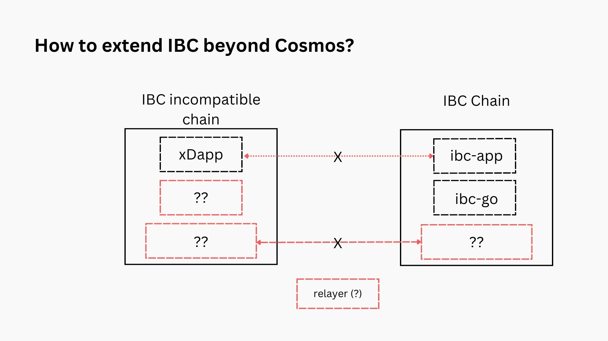

# How to extend IBC?

The [traditional IBC setup](../ibc.md/#ibc-as-you-know-it-already) works when both chains are Cosmos chains (or any other chain that has a native IBC implementation), but what if we want to introduce another chain that does not have a native IBC implementation available?

## Development requirements for IBC expansion

To enable IBC for an chain that is not natively compatible, a **non-trivial amount of development work would have to be completed**:

- an IBC transport layer implementation for the environment of the particular chain (some implementation other than ibc-go are being worked on like [ibc-rs](https://github.com/cosmos/ibc-rs) for Rust-based chains, but are not yet as mature as the former)
- a light client representing Cosmos chains (with Tendermint consensus) on the new chain
- a light client representing the new chain on Cosmos chains
- relayer support for the new chain

While we'll see continued efforts to expand the number of IBC implementations, light clients and relayer implementations, the **demand for interoperability solutions is here right now**. Is there a faster path to IBC integration?

### Is there more?

The difficulty of integrating IBC in heterogeneous chains is one limitation, but there are others as well.

The current IBC limitations:

- **Chain integration**: non-trivial non-native IBC integration, potential incompatibility of underlying chain data structures
- **Scalability**:
  - densely connected, every chain is currently connected directly to every chain it wants to send packets to
  - state bloat when interop scales due to permanent transport commitment writes
- **Maintenance**: to upgrade the ibc-go version a chain uses it is currently required to upgrade a Cosmos SDK chain, which bring maintenance overhead. This complexity increases with the number of different IBC implementations and technology stacks other than the cosmos SDK that IBC gets integrated natively into.

## Solution?

Polymer provides a solution that **accelerates IBC adoption through a number of crucial innovations**, leveraging the most mature and feature-rich IBC implementation around today.

Let's find out how in the next section.
