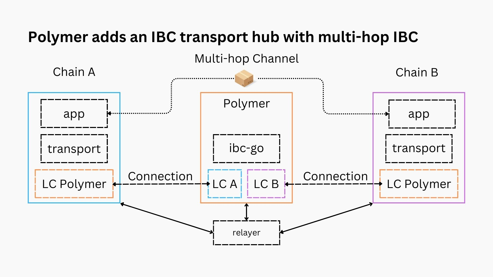

# Step 1: Multi-hop support

Ultimately Polymer will place itself as an IBC router hub in between two chains wanting to connect over IBC. For this, it relies on the [multi-hop IBC specification](https://github.com/cosmos/ibc/pull/882) that ensures that chains can send packets over IBC between one another despite them not having a direct IBC connection, instead leveraging multiple hops where IBC connections do already exist.

Read more about it in this [blog post](https://polymerlabs.medium.com/the-multi-hop-ibc-upgrade-will-take-ibc-to-ethereum-and-beyond-b4bee43523e).

