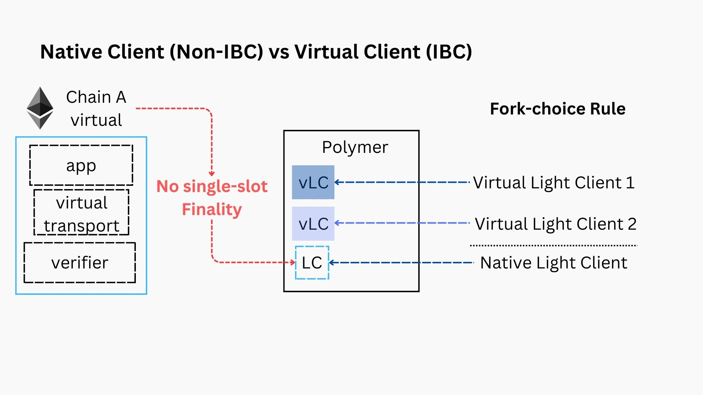

# Native & virtual clients

Making consensus ZK-friendly and flexible via the [zkMint consensus engine](./zkmint.md) ensures efficient and cost-effective verification of Tendermint consensus on the virtual chains. This solves one of the issues of integrating IBC into non-natively compatible chains.

There's more though... .

## Accounting for forks

Another issue of Ethereum with regards to IBC compatibility, is that it does not have single-slot (fast) finality. Finality is a requirement for native IBC integration. So how do we go about solving that?

The IBC specification did already foresee a solution for this, which the Polymer protocol drew inspiration from. From [the spec](https://github.com/cosmos/ibc/blob/5394ad096835f536a34678acaffd014c14c7d3b3/spec/core/ics-002-client-semantics/README.md#motivation):

> Quote: The IBC protocol can be used to interact with probabilistic-finality consensus algorithms. In such cases, different validity predicates may be required by different applications. For probabilistic-finality consensus, a validity predicate is defined by a finality threshold (e.g., the threshold defines how many block needs to be on top of a block in order to consider it finalized). **As a result, clients could act as thresholding views of other clients**: One write-only client could be used to store state updates (without the ability to verify them), while many read-only clients with different finality thresholds (confirmation depths after which state updates are considered final) are used to verify state updates.

### Native light client

This would be the _write-only_ client mentioned in the IBC spec, to which we supply the headers from the virtual chain.

This client, in virtual IBC lingo we call it a native light client, is **not IBC compatible**.

:::info Altair light client

For Ethereum, we run a light client based on the Altair light client spec. A more elaborate discussion of the light client and sync committees is out of scope of this article, but you can watch [this podcast segment](https://youtu.be/1skznXEWeJM?t=1090) to find out more.

:::

### Virtual light client

Virtual IBC defines virtual light clients that could implement different security parameters for its view into the native light client.

This would be the _read-only_ clients with different finality thresholds, as mentioned in the IBC spec.

Many virtual clients thus can be associated with a single native light client.

:::info

For example, a virtual light client could wait for finalized headers while another virtual light client could only wait a few blocks, establishing a trade-off between security and latency (and thus, UX).

:::

Essentially, the virtual light client establishes a fork-choice-rule over the forks in the native light client. A **virtual light client fulfils the requirements as an IBC client** and can be used to build (virtual) connections on top.
