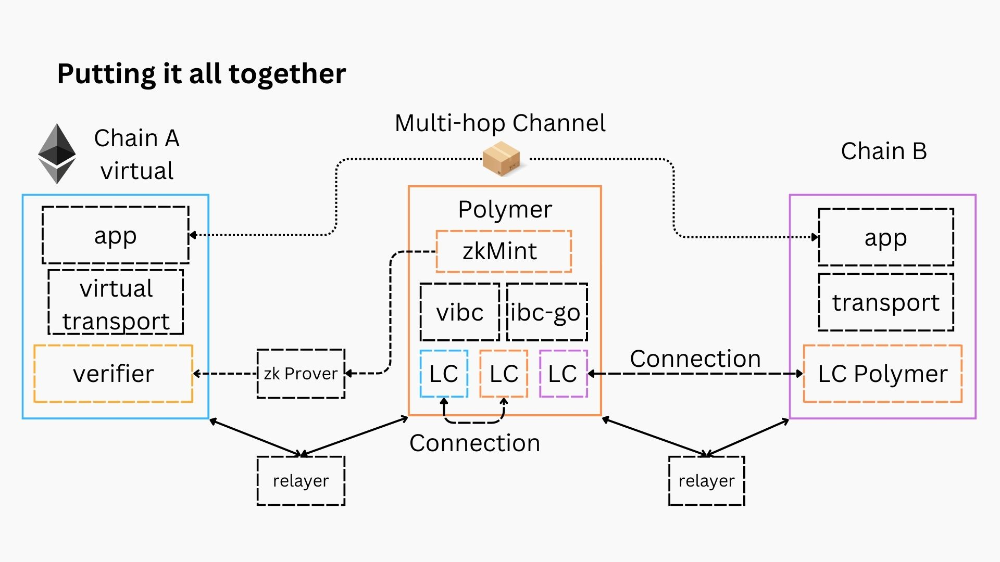

# Summary of the Polymer protocol

The different concepts of the Polymer protocol, combine together to accelerate IBC expansion to chains or ecosystems that do not have native IBC implementations. In turn, we believe that this will lead to IBC and the Polymer Hub to become the backbone of blockchain interoperability.

Polymer reduces the complexity of IBC integration to a point where integrating IBC becomes as simple as deploying a rollup on a (consensus and) data availability layer, like Celestia.

:::tip Virtual IBC multi puropose

Note: Virtual IBC or the outsourcing of the IBC transport layer to an IBC router hub like Polymer, is crucial for chains that lack native IBC iplementations.

However **also chains which do have the ability to run a native IBC integration might choose to become a virtual chain**, outsourcing the transport layer to Polymer.

_Why_? Scaling and specialization! When interoperability explodes, individual chains may have to spend a significant amount of blockspace and resources to running the transport layer. It would make sense to outsource this to a dedicated IBC router hub.

:::

Additionally, there is a non-trivial amount of maintenance overhead with version upgrades of Cosmos SDK chains (required to upgrade the ibc-go version a chain uses). This complexity increases with the number of different IBC implementations and technology stacks other than the cosmos SDK that IBC gets integrated natively into. **Having Polymer provide IBC as a service removes this maintenance overhead**.

## Putting it all together

Let's repeat the components the Polymer architecture is comprised of:

- A virtual chain, in turn consisting of:
  - an application (smart contract or module) that is IBC enabled
  - vIBC smart contracts, making up the virtual transport layer
  - a verifier smart contract that can verify ZKPs corresponding to Tendermint conensus proofs from the IBC hub
- An IBC compatible chain, in turn consisting of:
  - an application (smart contract or module) that is IBC enabled
  - a core IBC module, the transport layer
  - a light client, representing IBC hub state
- An IBC router hub, e.g. Polymer chain, consisting of:
  - a ZK-friendly consensus engine, zkMint
  - a vIBC module to complement the ibc-go core module
  - a light client representing the IBC compatible chain
  - a localhost client
  - a virtual client representing the virtual chain's state, providing a thresholding view of the virtual chain's native client
- At least 1 of the following off-chain processes:
  - an IBC relayer relaying packets between native IBC chains
  - a vIBC relayer relaying messages between a virtual chain and an IBC router hub
  - a ZK prover circuit that computes ZKPs of the IBC hub's consensus to provide the virtual chain's verifier contract
- Suppose two IBC connections exist: virtual chain <-> Polymer and Polymer <-> IBC chain

:::note

The B side could also be a virtual chain, but the diagram becomes more complex for visualization purposes

:::

### Multi-hop channel creation

With the above setup, you can establish a multi-hop IBC channel on top of the existing connections (remember, no need to create a direct connection between virtual chain and IBC chain).

The channel handshake can be triggered from either side or by a relayer.

Once the channel successfully goes through the channel handshake, IBC packets can be sent on the channel 📦📦📦!

### What about relayers?

In the previous sections, we've been purposely sparing with details on relayers. You'll have noticed a distinction made between _regular_ IBC relayers ([go relayer `rly`](https://github.com/cosmos/relayer), [rust relayer `hermes`](https://github.com/informalsystems/hermes) and [TS relayer](https://github.com/confio/ts-relayer)) on the one hand and vIBC relayers on the other.

<!-- TODO: insert link after creating relayer docs -->

Relayer teams and the relayer operators are the unsung heroes of the IBC powered Interchain and deserve a dedicated section, which you can find [here](#what-about-relayers).

## Conclusion

Polymer solves the following current IBC limitations:

- **Chain integration**: from non-trivial non-native IBC integration to _one-click IBC integration_.
- **Scalability**:
  - multi-hop enables the growing interchain to be sparsely connected, while maintaining coverage
  - more scalable to offload packet writes, computing transport commitments and verifying client logic off chain, by outsourcing through Polymer.
- **Maintenance**: outsourcing to Polymer reduces upgrade overhead
