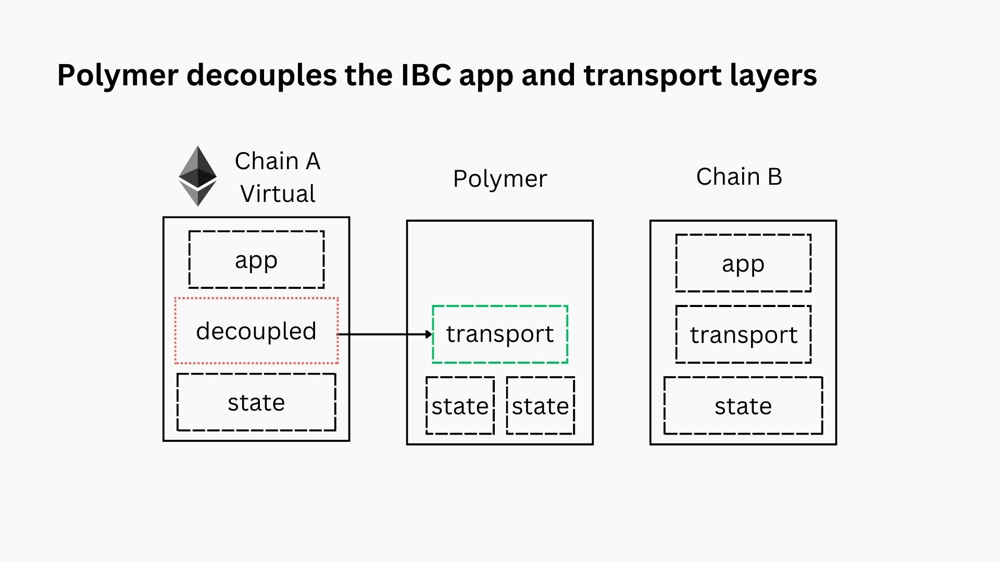
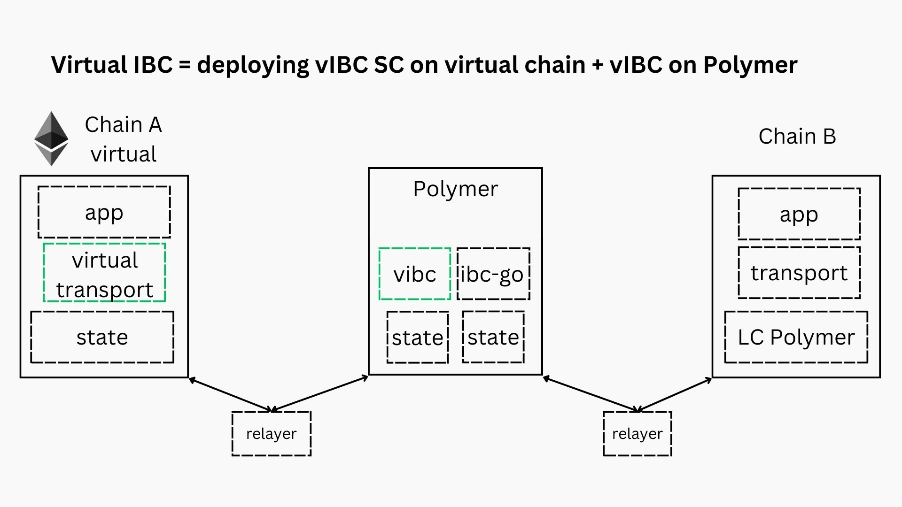
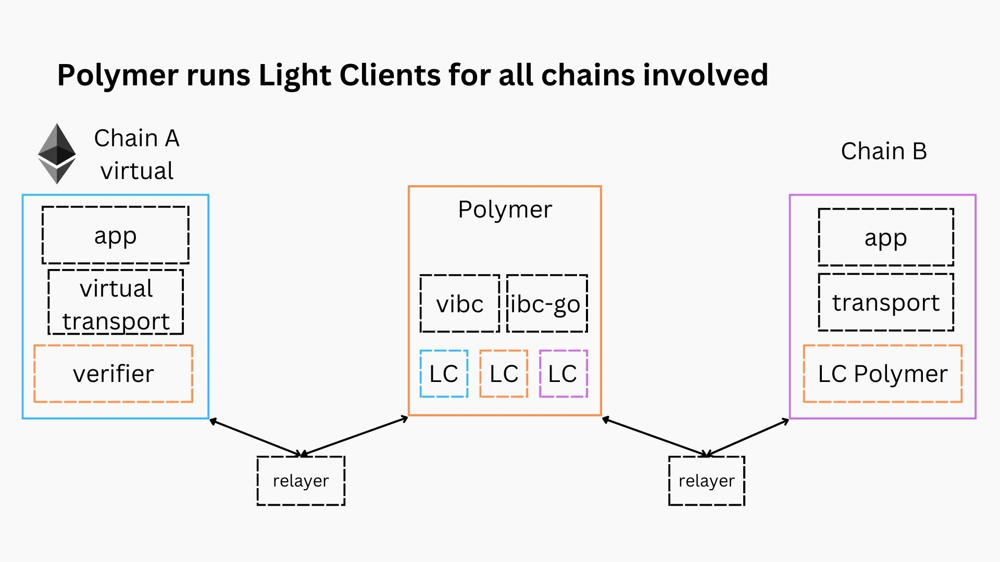

# Step 2: Virtual IBC

In the previous step we added Polymer as a hub in between two Cosmos chains. Now let’s replace one of the chains with a chain that is not natively compatible with IBC, like Ethereum.

Introducing the middle hop alone, does not solve the issue. Even though there’s been some work done on an [IBC core implementation in solidity](https://github.com/hyperledger-labs/yui-ibc-solidity), verifying Tendermint consensus (representing Polymer chain) on the EVM is prohibitively expensive, please refer to [this blog post](https://polymerlabs.medium.com/zkmint-the-first-zk-friendly-tendermint-consensus-engine-116000b9d4f9) for more background.

The solution provided by Polymer is to **outsource the transport (and part of the state) layer** to the Polymer chain. This fits within the [modular interoperability framework](https://polymerlabs.medium.com/modular-ibc-for-the-modular-world-9fc021f6322e).

:::info Modular interoperability

The application and transport layer separation have always been part of the IBC design, ever since its conception. This has the benefits of separating the concerns of application and core developers respectively.

Polymer takes this modularity a step further though. Similar to the ideas of _modular blockchains_ introduced by [Celestia](https://celestia.org/learn/basics-of-modular-blockchains/modular-and-monolithic-blockchains/), Polymer proposes the concept of _modular interoperability_. This means that **all 3 layers of an interoperability protocol (app, transport and state) still form a logical whole, yet they can be decoupled onto different chains.**

:::

## Virtual transport with vIBC

Instead of running an entire IBC implementation (including an on-chain light client that verifies Tendermint consensus inside the EVM), **two simplified components need to be added to Ethereum**.

1. **vIBC core smart contracts** (virtual transport in the diagram). These smart contracts will satisfy the required IBC interfaces to handle channel and connection handshakes, and the packet flow (send + callbacks).

The vIBC (virtual IBC) module on Polymer’s side handles the changes related to introducing a virtual transport layer.

2. **A verifier contract**. The verifier contract deployed on the EVM is able to verify the consensus proofs of the Polymer chain. Note that Polymer is also running a client for itself (on behalf of the virtual chain), through the [localhost or _loopback_ client](https://ibc.cosmos.network/main/ibc/light-clients/localhost/overview.html).

:::caution Tendermint consensus proof verification in EVM

As consensus proof verification for Tendermint consensus (Polymer chain is a Cosmos SDK chain) is prohibitively expensive, a solution was found to have the verifier contract verify Zero-Knowledge Proofs (ZKP) instead. More on that in the [next section on zkMint](./zkmint.md)

:::

## Conclusion

We end up with a situation where an IBC application on the virtual chain (e.g. Ethereum) can trigger IBC interactions with the Cosmos chain B, through the vIBC core smart contracts which then outsources the heavy lifting to the Polymer chain running the IBC transport layer on behalf of Ethereum. We call this _virtual IBC_ and Ethereum in this case acts as a _virtual chain_.
