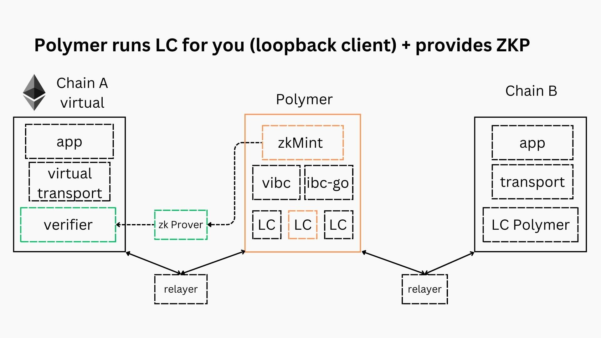

# Reducing EVM consensus proof verifcation cost with zkMint

The Polymer chain, through its consensus engine zkMint, will generate a header with signatures optimized for an off-chain zero-knowledge (ZK) circuit and verification in the EVM . An off-chain ZK prover will produce a zero-knowledge-proof (ZKP) of (Polymer’s) consensus that is verified on Ethereum (virtual chain) by the verifier contract, providing a significant reduction in gas cost.

