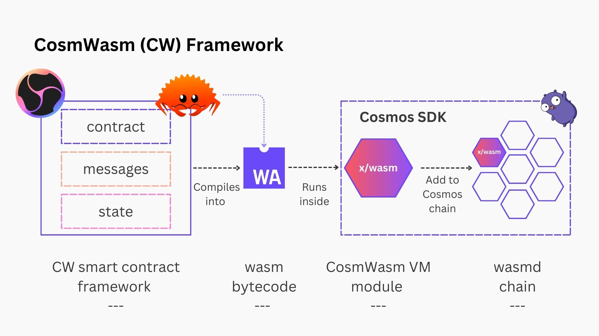
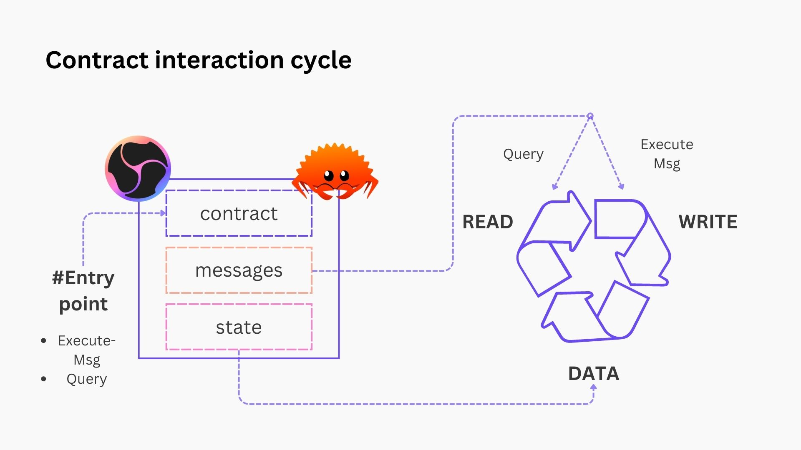
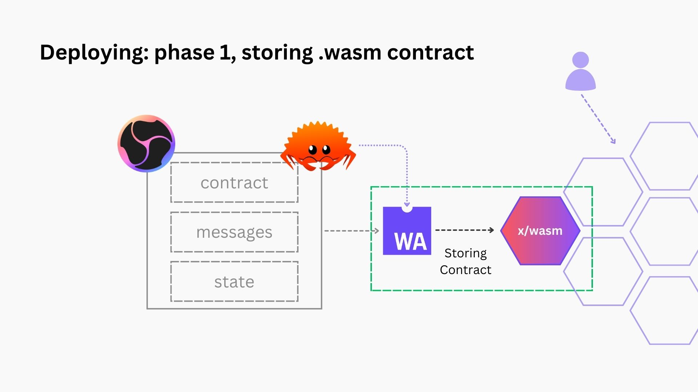
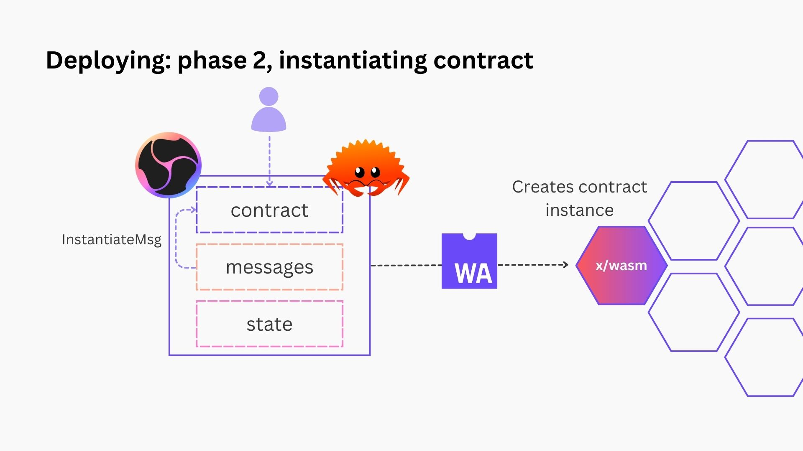

# CosmWasm Developer Essentials

One of the smart contracting frameworks that are supported by the IBC SDK, is [CosmWasm](https://cosmwasm.com/) (CW). CosmWasm enables developers to write smart contracts (usually in Rust) that compile down to WebAssembly (wasm) and deploy those in a CosmWasm virtual machine that can be added to Cosmos chains (technically, Cosmos SDK chains). Hence the name CosmWasm, _Cosmos + Wasm_.

CosmWasm originated as a project during a _HackAtom_ hackathon in Berlin in the summer of 2019. Since then, it has come a long way and currently has a stable release version >1.x.y. The [Confio team](https://confio.gmbh/) is the primary maintainer of CosmWasm.

Despite the strong design of the framework and technical soundness, the tooling and documentation are still nascent. Therefore a quick conceptual overview will be given of the essentials, before referring to resources that go more in-depth.

:::info Structure of the section

- **CosmWasm essentials**: a high-level overview of the framework, the context in which it operates and resources for further learning
- How to **use IBC in CW**: CosmWasm was designed with interoperability in mind, we'll explore how to make good use of this
- How to **interact with CW contracts** as a client: it's not always necessary to write the CW contracts, or even thoroughly read them, to make use of their functionality in your cross-chain dApps. We'll learn how to make use of the contract schema to interact with it.

:::

Resources:

- [Awesome CosmWasm](https://github.com/CosmWasm/awesome-cosmwasm)
- [CW Resources](https://github.com/CosmWasm/resources)
- CW with IBC resources can be found in the [next section](./2-ibc-cw.md)

Let's dive into it!

## The CosmWasm framework

CosmWasm is the overall name that is often used to refer to a set of components that work together in unison to create a framework to build smart contracts that compile to wasm, to be deployed onto Cosmos SDK blockchains. In many resources the focus is on one aspect of the entire flow, which can make the holistic view rather vague. Still it's crucial to understand how all of the components fit together before moving on to actually building and testing your smart contracts.

Consdier the diagram below.



You'll notice a number of different components:

- A smart contract developer will write smart contracts using the CW framework in Rust. The contract source code will often be split into separate files with specific concerns.
  - The `contract.rs` file contains the entry points to interact with the contract.
  - The `msg.rs` file will contain the different messages those entry points are expecting.
  - The `state.rs` file contains the contract state that is stored on-chain.
- The contract source code then compiles into a `<contract>.wasm` file with WebAssembly bytcode.
- The wasm bytcode will run inside a virtual machine, the CosmWasm VM. This VM is built as a module `x/wasm` (following Cosmos SDK module naming convention) to be added to Cosmos SDK chains which can add as many modules in a modular way as they want.
- Finally, the `x/wasm` module can be added to a Cosmos SDK chain. For example, the `wasmd` chain is a custom chain maintained by the Confio team that has all of the standard Cosmos SDK modules (like bank, staking, IBC, ...) and adds `x/wasm` to create a minimal wasm-enabled chain that can be used for testing purposes. The `x/wasm` module can be imported into other Cosmos SDK chains to enable smart contracting functionality.

:::note

Unlike the smart contracting frameworks which uses Rust to build contracts, the Cosmos SDK is written in Go.

:::

### CosmWasm contracts on Cosmos chains

_Why is the overall picture important to understand?_

:::tip

Consider the synergies there are by putting the CW VM inside a Cosmos SDK chain, which still includes a lot of core blockchain functionality in its modules.

Everyting related to accounts, bank (transfer etc.), staking and interoperability have primitives in the core modules and developers do not need to implement all of this in smart contracts. This has security and developer UX benefits.

:::

Getting a good grasp on how to distribute and manage interaction between contracts and core modules in CW enabled chains, will go a long way to becoming a superstar CW developer.

## Building smart contracts

How to build CW smart contracts is the most documented part of the whole process, so you are invited to check out these resources to find get started:

- [Anatomy of a CW smart contract](https://www.youtube.com/watch?v=7Snfn7o99Yw) (video)
- [CW Zero-to-Hero](https://www.youtube.com/watch?v=ocR-1FvIQD8) (video)
- [CosmWasm Book](https://book.cosmwasm.com/) (written)
- [Example contracts](https://github.com/deus-labs/cw-contracts)(code)
- [Archway CW docs](https://docs.archway.io/developers/cosmwasm-documentation/introduction) (written)
- ...

### Key take-aways

Let's quickly review the most important take-aways from the resources listed above.

#### CW-template for boilerplate

Every application (single or multi contract) needs a project set up which contains quite a bit of boilerplate code. To get developers set up more quickly, a [template](https://github.com/CosmWasm/cw-template) can be used to quickly set up the boilerplate.

```bash
# in case you've not got cargo generate installed
cargo install cargo-generate --features vendored-openssl
cargo install cargo-run-script

# generating the template project (set minimal to true to strip example code)
cargo generate --git https://github.com/CosmWasm/cw-template.git --name PROJECT_NAME <-d minimal=true>
```

Once completed you'll have a project directory where in the `/src`folder you find the `contract.rs`, `msg.rs`, and `state.rs` files mentioned earlier, among others.

#### Contract entry points and interactions

The "Anatomy of a smart contract" YouTube video does a great job explaining how the interaction (cycle) of a smart contract works once instantiated (see below).

Essentially, the contract can store some state which is defined in the `state.rs` file. It also exposes the entry points EXECUTE and QUERY. These can have different types of messages attached to write to or read from the contract or the chain's state.



```rust
#[entry_point]
pub fn instantiate(
  deps: DepsMut,
  env: Env,
  info: MessageInfo,
  msg: InstantiateMsg,
) -> Result<Response, ContractError> {}

#[entry_point]
pub fn execute(
  deps: DepsMut,
  env: Env,
  info: MessageInfo,
  msg: ExecuteMsg,
) -> Result<Response, ContractError> {}

#[entry_point]
pub fn query(deps: Deps, env: Env, msg: QueryMsg) -> Result<Binary, ContractError> {}

// this is a more advanced entrypoint when upgrading contracts
#[entry_point]
pub fn migrate(deps: DepsMut, env: Env, msg: MigrateMsg) -> Result<Response, ContractError> {}
```

Apart from adding IBC (see [next section](./2-ibc-cw.md)), this is the most common flow you'll encounter in CW development.

## Deploying contracts

Once you've developed your contract and tested it with Rust's test suite, you can now go ahead and start the process to deploy the contract on chain.

Unlike with the Ethereum Virtual Machine (EVM), contract deployment does not immediately instantiate it in CosmWasm. Instead there's two steps: **storing the contract on-chain** and **instantiating** it.

This enables multiple instances of the same _contract type_ with different parameters to be instantiated without having to store a new contract every time. In the EVM world, this can be likened to _creator contract_ who have the ability to create instances of a contract type.

### Storing .wasm on chain

The `x/wasm` runtime provides an endpoint to store wasm bytecode to the CW VM. For example, when using the `wasmd` chain:

```bash
wasmd tx wasm store <path to contract.wasm> [args]
```

This will store the contract at a certain address `wasm1xyz...`.



:::caution

Remember that blockchain data storage is expensive, so as a smart contract developer you must ensure that the wasm bytecode to store on-chain is compressed as much as possible. There's a [rust-optimizer repo](https://github.com/CosmWasm/rust-optimizer) that does this job for you.

To use it, run the following command from your project root directory:

```bash
docker run --rm -v "$(pwd)":/code \
  --mount type=volume,source="$(basename "$(pwd)")_cache",target=/code/target \
  --mount type=volume,source=registry_cache,target=/usr/local/cargo/registry \
  cosmwasm/rust-optimizer:0.12.13
```

:::

It will create an `/artifacts` folder with `<crate_name>.wasm` the wasm bytecode.

:::tip Use the wasm bytecode path in IBC SDK

The path to the .wasm file is what you'll need to provide as an argument when deploying the contract on chain with IBC SDK!

:::

### Instantiating a contract instance

Instantiating the contract via `wasmd`:

```bash
wasmd tx wasm instantiate [args][options]
```

Note that the instantiate call needs to have as an argument a JSON file with the input arguments according to the `IntantiateMsg` defined in the contract.



### IBC SDK to the rescue

Don't like that the deployment is split up into two phases? Don't worry, the IBC SDK allows you to deploy (store and instantiate) through a single command, the `deploy` command. Read more about it [here](../../ibctl/5-tx.md/#deploying-smart-contracts).

## Tooling: many hands make light work

As mentioned in the introduction, the CosmWasm ecosystem is still young and tooling is an area that is going to keep evolving through contributions from many different orgs.

Keep an eye on the [tooling section](https://github.com/CosmWasm/awesome-cosmwasm#tooling) in Awesome CosmWasm.

An additional tool to keep an eye on is [Celatone](https://celat.one/), which makes it easy to explore, deploy, interact, and organize smart contracts on various networks.
