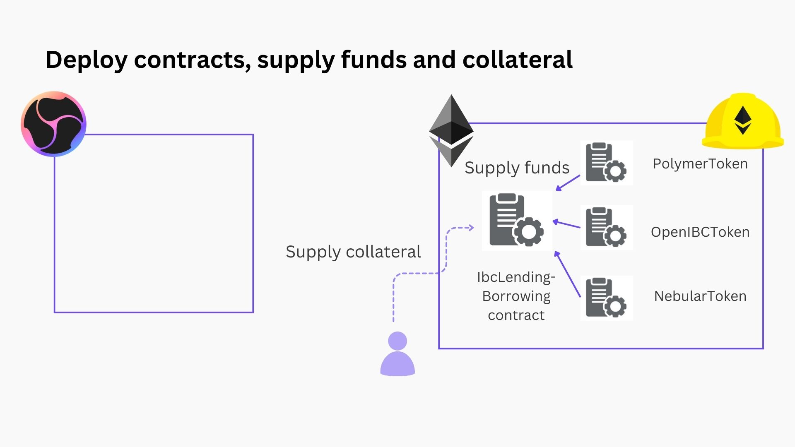
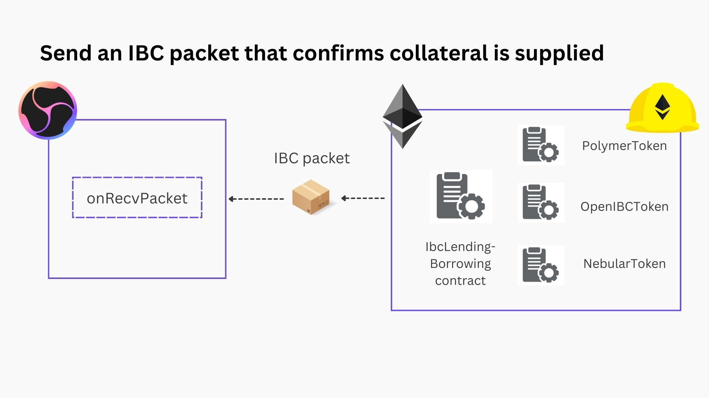
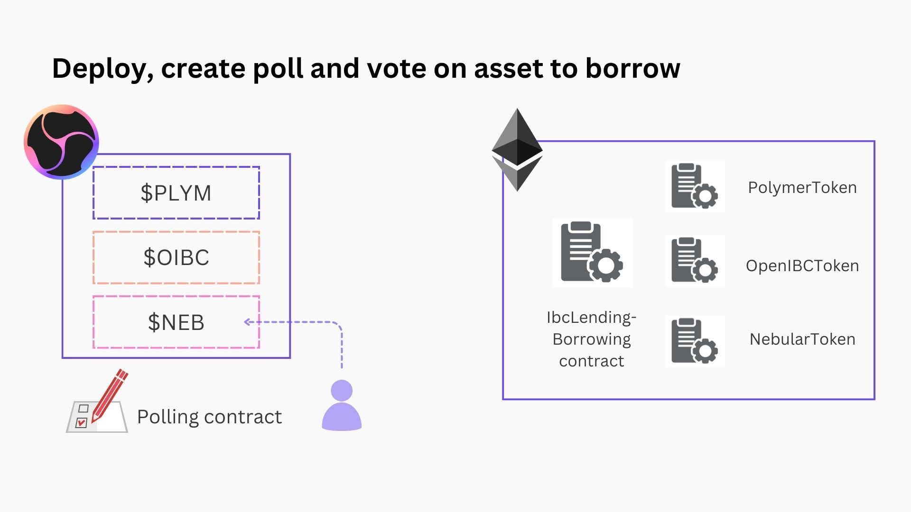
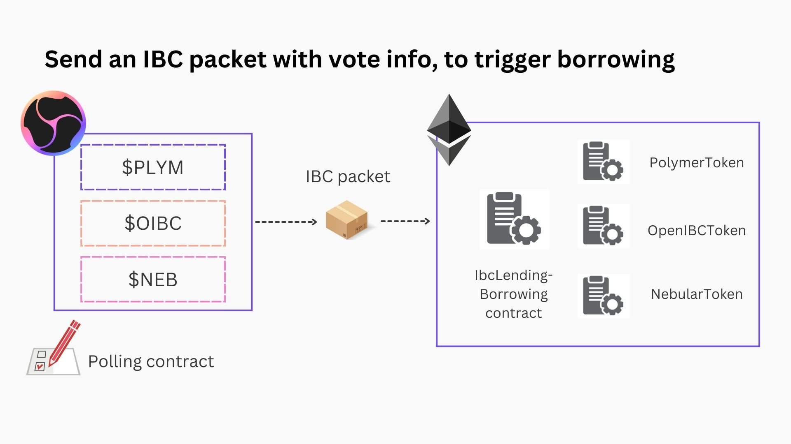
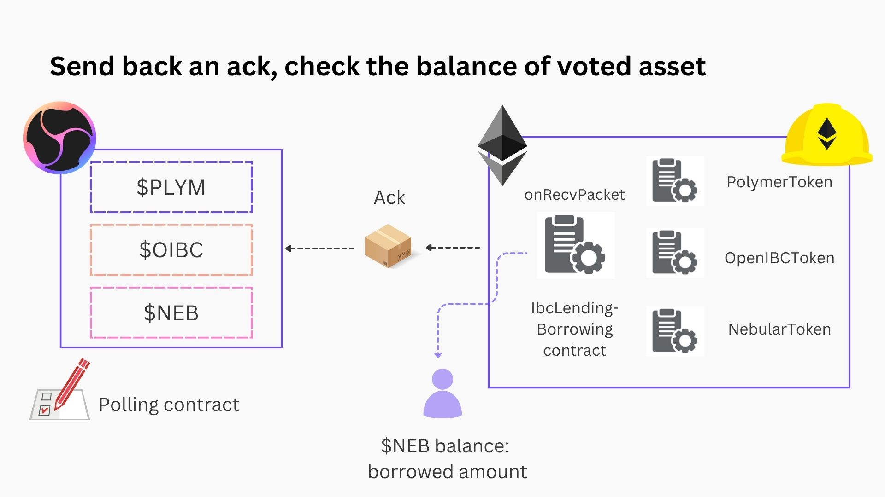

# Quickstart tutorial 2: Vote cross-chain on asset to borrow

In the [first quickstart tutorial](quickstart-1.md) you were able to see how easy and effcient it is to go from project setup to sending your first packet. The contracts we used there were rather basic though, not representative of a real world use case.

:::tip Let's get real

In this second tutorial we'll explore a more realistic application that will also focus more on using your own smart contract development environment.

:::

**What will you be developing?**

Consider a lending/borrowing application (think Aave, Compound, MakerDAO, Umee, ...). We'll have a simplified version of this application by deploying an IBC enabled `IbcLendingBorrowing` contract, as well as 3 `Token` contracts (inspired by the [Hardhat tutorial](https://hardhat.org/tutorial)). Instead of directly lending and borrowing though, we'll have polling smart contracts on a remote chain vote on what asset to borrow (having collateral provided). Then when the poll has ended and the votes have been cast, we'll send an IBC packet with information about the poll and the winning token to be borrowed cross-chain.

For this tutorial the lending/borrowing will happen on Ethereum, the polling contract (credits to the [tutorial on SparkIBC's YT channel](https://www.youtube.com/watch?v=ocR-1FvIQD8)) will be deployed to a `wasmd` chain.

:::note Feature overview

- Deploy contracts (IBC enabled `IbcLendingBorrowing` contract + 3 Token contracts) on ETH using Hardhat
- Interact with the deployed contracts through client library (Harhat/ethers.js in this case)
- Have IBC enabled contracts on Ethereum send and receive packets, enabled by virtual IBC
- Deploy and interact CosmWasm contract through `ibctl` CLI tool
- Advanced event and packet tracing to check the status of your IBC packets

:::

The following assumptions are made before you start:

:::info Prerequisites

- you've gone through the installation process and have the `ibctl` binary installed, if not please refer to the [installation instructions](../#installation-and-quick-start)
- you're comfortable with the basic IBC semantics, if not please refer to the [IBC high-level overview page](../concepts/IBC/ibc.md)
- you're comfortable with the [EVM and CosmWasm dev enviroments](../dev-environment/) and how to interact with chains (through client libraries)
- you've got a healthy dose of enthusiasm ready to explore our cross-chain voting/borrowing application 🚀

:::

## Preparation steps

Now, for the quickstart tutorial you can follow along with the example projects/contracts we'll provide.

**Example contracts**:

Clone the following GitHub repos to follow along with the tutorial:

- The [EVM project](https://github.com/tmsdkeys/hardhat-ibc-sdk-tutorial/tree/main) with the IBC enabled `IbcLendingBorrowing` contract + 3 Token contracts. It's a Hardhat project, so to be able to run `npx hardhat [command]`, make sure to run `npm install` first.
- The [CosmWasm project](https://github.com/tmsdkeys/ibc-sdk-cw-tutorial/tree/main) with the polling contract. You'll find the contract .wasm bytecode in the `/artifacts` folder if you don't want to bother checking out the code.

## Starting the IBC SDK

Starting the CLI tool:

```bash
ibctl start -c wasm:polymer -c polymer:eth-execution
```

when everything is set up, check the running containers:

```bash
ibctl show
```

:::tip Connect client library with IBC SDK exposed endpoint

During development, you'll likely want to connect your development environment with the multi-chain environment set up by the IBC SDK. The `ibctl show` command reveals the RPC endpoints that are exposed for you to interact with.

:::

For Hardhat specifically, find the endpoint where 'eth-execution' is exposed and add it to the hardhat config file:

```js
require('@nomicfoundation/hardhat-toolbox')

/** @type import('hardhat/config').HardhatUserConfig */
module.exports = {
  solidity: '0.8.19',
  networks: {
    localibcsdk: {
      url: 'http://localhost:<fill-in-port>',
      accounts: [
        '0x826cccccf88094269e637c816d8895f138b89e03dfa2fdd8b5d9e1feea1cb9aa',
        '0x15188f87d4fd462b13c8f3b81c3a818ceb68fb596da273d6b7ee9f05f588e207',
        '0x75558cf96f6f28bb489fd33cbfc38aa2311bcb6586a9742f9586da809dd57fe2',
        '0xea6ad02a06e84b195f65a7e01ab32440a8914e523d53be71aba370167ce94ae9',
        '0xbaeb0652f541c24abdf69216fec5136bda1a013dea71ab24bb3b477143efa9ef'
      ]
    }
  }
}
```

The accounts (unless you want to add more) can be left as is and will provide you 5 default funded accounts.

## Deployment and channel creation

Now, you can deploy the contracts on the EVM:

```bash
npx hardhat run scripts/deploy.js --network localibcsdk
```

and on the Cosmos side:

```bash
ibctl deploy wasm wasm158z04naus5r3vcanureh7u0ngs5q4l0gkwegr4 <path>/artifacts/ibc_poll_messenger.wasm
```

:::tip

You've now deployed IBC enabled contracts on both sides, the remaining thing to do is to create an IBC channel. Remember that the IBC SDK has set up the required clients and connections on the `start` command.

You can always check the clients/connections/channels with the command:

```bash
ibctl [clients/channels/connections] <chain-name>
```

:::

Create a channel between the IBC enabled contracts on the EVM and Wasm side:

```bash
ibctl channel $'eth-execution:polyibc.Ethereum-Devnet.B10c73e50B9bdB51f3504F7104a411174B9C3aa3:1.0' $'wasm:wasm.wasm14hj2tavq8fpesdwxxcu44rty3hh90vhujrvcmstl4zr3txmfvw9s0phg4d:1.0'
```

You'll see the terminal output the different steps of the channel handshake. If successful, you now have a channel set up to send IBC packets over! 📦



## Contract interaction

Now that most of the infrastructure setup is out of the way, you can start interacting with the contracts which will culminate in sending some IBC packets back and forth.

### EVM side

:::note

On the EVM side, we need to prepare the following:

- For the three possible assets we can vote to borrow, we first need to supply funds to the `IbcLendingBorrowing` contract
- Then we need to supply some collateral, to borrow the winner of the vote on Wasm chain

:::

This is captured in the following script:

```bash
npx hardhat run scripts/interact.js --network localibcsdk
```

To let the Wasm chain know that we've provided collateral, we can use the IBC `sendMessage` functionality.

It's included in the `scripts/send-message.js` script:

```bash
npx hardhat run scripts/send-message.js --network localibcsdk
```



It will send the message `"Collateral has been supplied"`. The polling contract on the wasm side will receive this message so the poll on what asset to borrow can begin...

### CosmWasm side

:::note

On the Wasm side, we need to do the following:

- The admin (who deployed the contract) can create a poll (with the 3 options corresponding to the 3 tokens to borrow).
- Every user can vote on one of the options
- Only the admin can end the poll
- Once the poll is ended, we can send the result over IBC to trigger the borrowing on Ethereum

:::



This functionality is included in the `polling.sh` script.

```bash
sh ./polling.sh
```

The last command there is a message that should send an IBC packet with the information of the poll to execute the loan on the EVM side.



We can check the events and trace packets to see if we succeeded.

## Packet tracing and Events

As a first quick check to see if the packet has been successfully relayed and the loan executed, you can run:

```bash
npx hardhat run scripts/check-balances.js --network localibcsdk
```

If this shows "10n" you're good!



To look at the events for more fine grained details, run one of:

```bash
ibctl events polymer <-x>
ibctl events wasm <-x>
ibctl events eth-execution <-x>
```

The `events`` command focuses on all IBC events on a particular chain, alternatively you can trace the packets:

```bash
ibctl trace-packets $'eth-execution:channel-0:polyibc.Ethereum-Devnet.B10c73e50B9bdB51f3504F7104a411174B9C3aa3' $'wasm:channel-0:wasm.wasm.wasm14hj2tavq8fpesdwxxcu44rty3hh90vhujrvcmstl4zr3txmfvw9s0phg4d'
```

Packet tracing aggregates packet related queries between two "endpoints" essentially a (channel, port) pair on two chains.

## Conclusion

That wraps it up! You've now experienced a workflow where you built cross-chain applications to unlock functionality on one chain from an application flow on a remote chain. How cool is that?

Obviously, the sky is the limit so we look forward to seeing you experiment more with everything this unlocks :)
